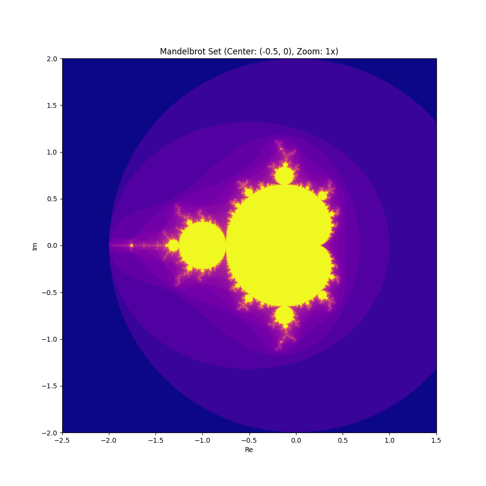
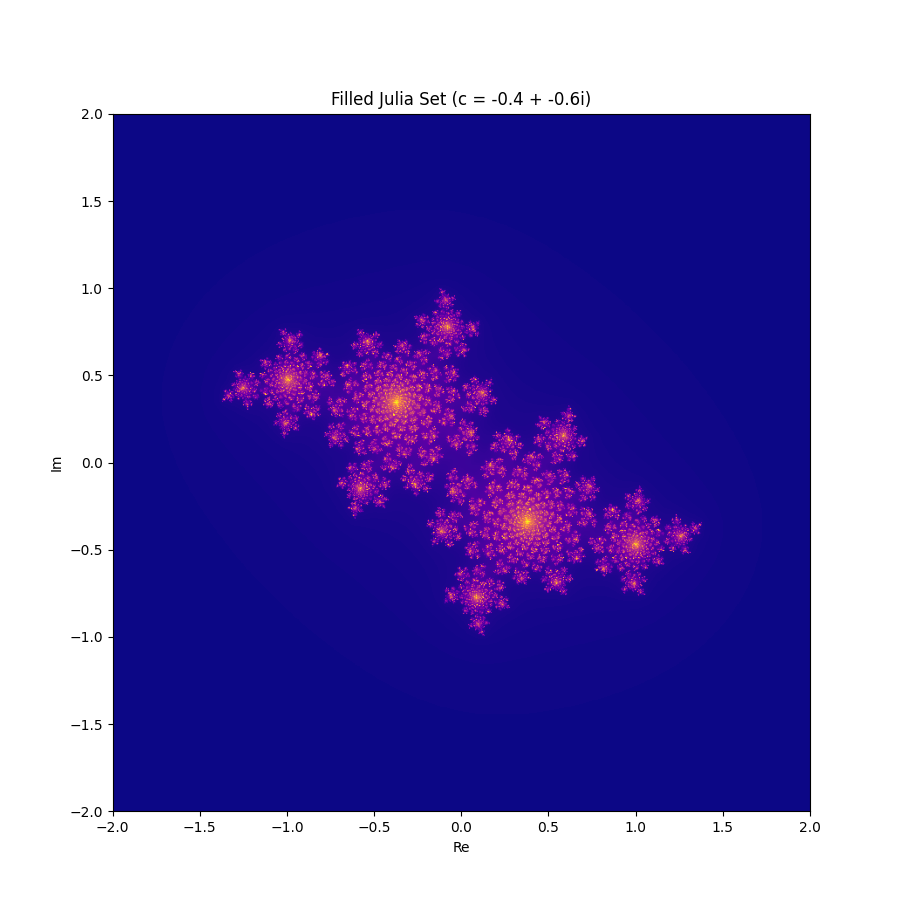
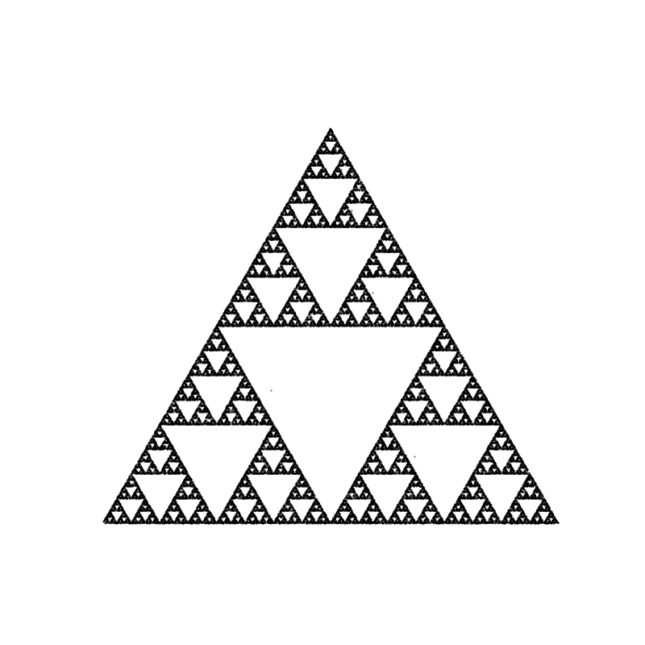
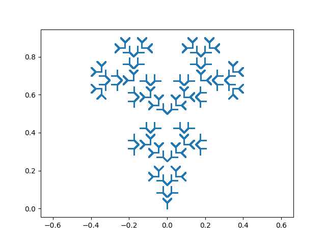

# Fractals

## Some Awesome Tools by [Mark McClure](https://marksmath.org)

* [Cobweb Plot](https://marksmath.org/visualization/cobwebs/)
* [Julia Sets and the Mandelbrot Set](https://marksmath.org/visualization/julia2.html)
* [Julia Sets](https://www.marksmath.org/visualization/julia_sets/)
* [Polynomial Julia Sets](https://www.marksmath.org/visualization/polynomial_julia_sets/)

## Samples

